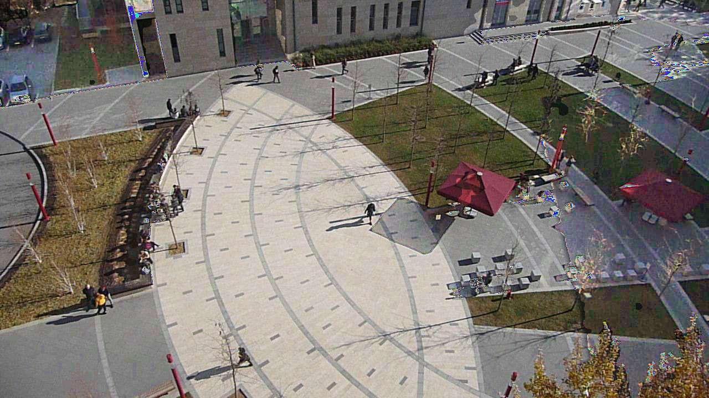

# shadow-removal  
Implementation of Shadow Removal Algorithms  
  
Tested for Python 3.7. Requires (might also work with older versions):  

 - OpenCV 4.2   
 - Numpy 1.17  
 - Scikit-image 0.16

The implemented methods:  
- Murali, Saritha, and V. K. Govindan.   
"Removal of shadows from a single image."   
the Proceedings of First International Conference on Futuristic Trends   
in Computer Science and Engineering. Vol. 4.  
  
- Murali, Saritha, and V. K. Govindan.   
"Shadow detection and removal from a single image using LAB color space."   
Cybernetics and information technologies 13.1 (2013): 95-103.

Example:

